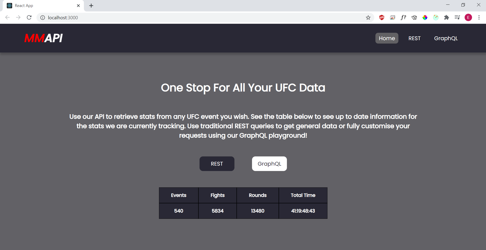
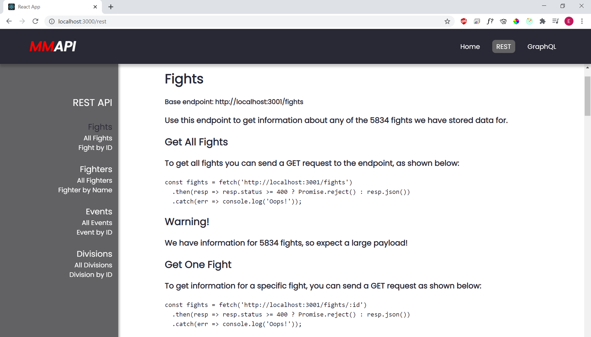
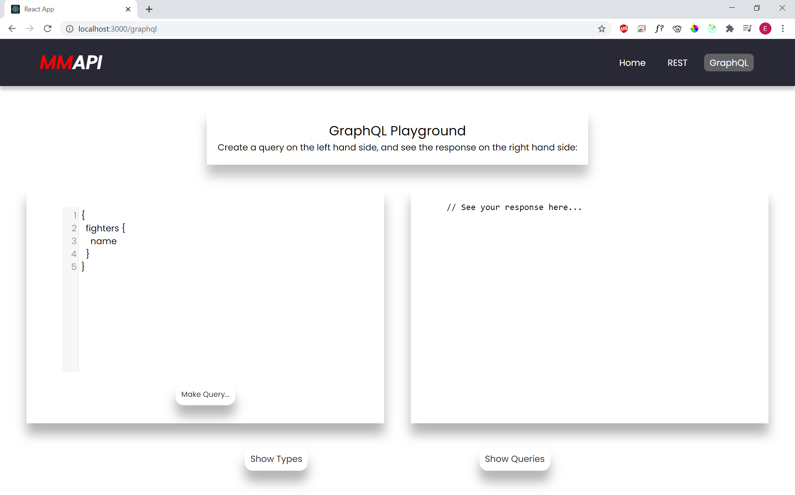
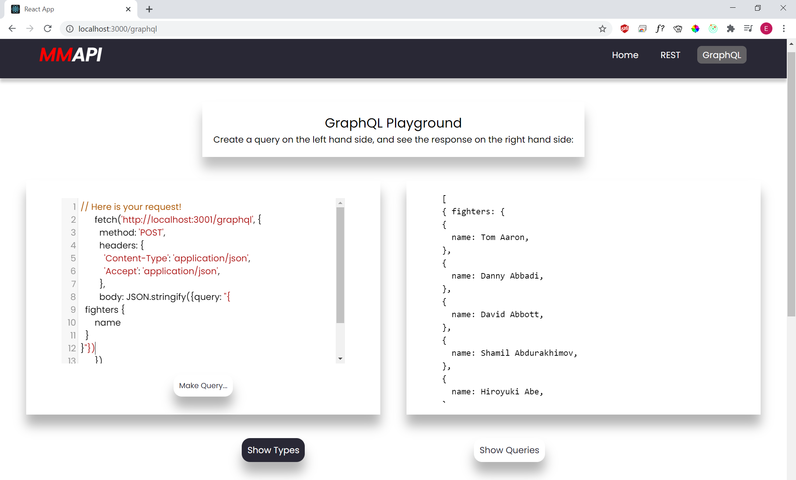

# MMAPI

  
 

MMAPI is the one stop API for all of your UFC data needs. The UFC is the worlds largest Mixed Martial Arts promotion company, having hosted 540 events and over 5000 fights.

The MMAPI holds data for every single one of these, as well as every fighter who has ever participated in the sport. Query our database using either traditional REST routes, or fully customise your queries using our GraphQL warpper. If you're not sure how to create a GraphQL query, don't worry, we have you covered. Use our GraphQL playground on our front end to design your exact query and preview the resposne you will get.

## Check Me Out

This app is hosted live on netlify, with the db being hosted as part of a digital ocean cluster.

[Find me live here.](https://mmapi.netlify.app/)

## Screenshots

  
 

            

  

            

  

            

  

## Tech Stack

* [React](https://reactjs.org/)
* [PostgreSQL](https://www.postgresql.org/)
* [Sequelize](https://sequelize.org/)
* [Express](https://expressjs.com/)
* [GraphQL](https://graphql.org/)
* [Apollo Server](https://www.apollographql.com/)
* [Cheerio](https://cheerio.js.org/)

## Contributors

* Elijah Burke - [GitHub](https://github.com/ElijahBurke) - [LinkedIn](https://www.linkedin.com/in/elijahburke/)
* Rafał Witczak  - [GitHub](https://github.com/rafwit) - [LinkedIn](https://www.linkedin.com/in/rafalwitczak/)
* Mandy Nijssen - [GitHub](https://github.com/manij89) - [LinkedIn](https://www.linkedin.com/in/mandy-nijssen-9784771bb/)

